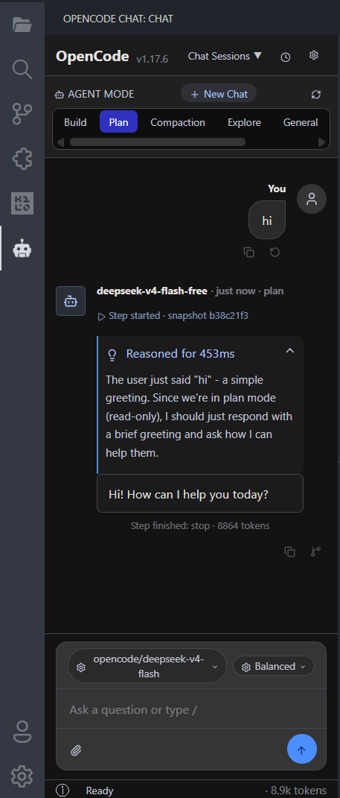
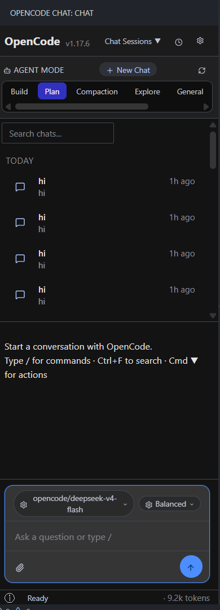

# OpenCode Chat

A full-featured chat UI for [OpenCode](https://opencode.ai) — the AI coding agent that runs in your terminal — now available as a sidebar extension for VS Code and any VS Code-compatible editor (VSCodium, Cursor, Windsurf, etc.).

[](https://marketplace.visualstudio.com/items?itemName=YasirArafat.opencode-ai-chat)
[](https://open-vsx.org/extension/YasirArafat/opencode-ai-chat)

Compatible with VS Code, VSCodium, Cursor, Windsurf, and any editor supporting the VS Code extension protocol. Install from the VS Marketplace or Open VSX — non-VS Code editors should use the Open VSX link.


*Chat with agent modes, model selection, and streaming responses*


*Select old chat to continue or start new chat*

## Features

### Core
- **Chat UI** — Full conversational interface with streaming responses, markdown rendering, and syntax-highlighted code blocks
- **Agent Modes** — Switch between agents (Plan, Build, Review, etc.) with one click
- **Model Selection** — Searchable model picker grouped by provider with key status indicators
- **Effort Variants** — Choose response effort: Balanced, High, Max, Minimal, Medium, Low
- **Streaming Responses** — Real-time token-by-token streaming with reasoning display
- **Abort** — Stop running responses instantly at any time

### Session Management
- **Session List** — Browse all sessions with time-based grouping (Today / Yesterday / Earlier)
- **Search Sessions** — Filter sessions by name or content via the search input
- **Rename** — Rename any session inline
- **Fork** — Fork a session to branch off a new conversation
- **Diff** — View session file changes inline with add/delete stats
- **Summarize** — Compact session history
- **Export** — Export any session as JSON; save the file with the modal's built-in Save button or copy to clipboard
- **Import** — Pick a session JSON file; the contents are shown in a viewer and a new session with the imported title is added to the list
- **Open Web GUI** — Launch the opencode web UI in a custom editor tab (with auth handled transparently)
- **Delete** — Remove unwanted sessions
- **New Chat** — Start fresh conversations with a single click

### Message Tools
- **Message Search** — Press `Ctrl+F` / `Cmd+F` to search within the current chat with match navigation (up/down arrows)
- **Copy Message** — Copy individual message content
- **Revert Message** — Revert to a previous version of a message
- **Fork from Message** — Fork a session starting from a specific message

### Commands & Input
- **Slash Commands** — Type `/` to browse and run 15+ built-in commands (help, diff, fork, share, review, sessions, skills, mcps, import, etc.)
- **File Attachment** — Attach workspace files via `@` mention menu or attachment icon file picker
- **Question Prompts** — Interactive question flows for plan/ask workflows with textareas and submit buttons

### Display & UI
- **Markdown Rendering** — Full markdown including tables, lists, headings, code blocks, links, images, and formatting
- **Code Highlighting** — Built-in syntax highlighting for 40+ languages with copy-to-clipboard
- **Thinking/Reasoning** — Real-time reasoning display that shows the model's chain-of-thought as it happens, giving you visibility into how the AI arrives at its answers for better understanding
- **Inline Tool Status** — Task cards showing running and completed tool calls inline
- **Token & Cost Tracking** — Token usage and cost per message, displayed in the status bar
- **File Display** — Inline file content rendering with language labels
- **Session State Info** — Modal showing CLI status, version, session IDs, model, agent, and more
- **Dark Theme** — Custom dark design that matches VS Code aesthetics
- **Responsive Layout** — Adapts to sidebar width with scrollable chat area

### Provider Management
- **Provider List** — View all configured providers with API key status (connected/missing)
- **Model Count** — See how many models each provider offers
- **Multi-Provider** — Works with any provider configured in the opencode CLI

## Why OpenCode Chat

Beyond the feature list, here's what makes this extension feel different to use.

### See the AI think
- **Live reasoning stream** — watch the model's chain-of-thought unfold in a collapsible card right next to its answer, token by token.
- **Streaming that just works** — text flows in as the model generates it, with no flicker, no re-renders, no dropped chunks on busy agents.
- **Effort presets** — one-click switch between Balanced, High, Max, Minimal, Medium, and Low to trade speed for depth.

### Know what you're spending
- **Token and cost counter** in the status bar shows you exactly what each session used, with friendly k/M formatting.
- **Cache-aware totals** — the count respects cached reads and writes, so the number reflects what you actually pay.
- **Session info modal** — a quick `ⓘ` reveals the CLI version, session IDs, and which model/agent is active.

### Sessions follow you everywhere
- **Auto-discovery across the opencode ecosystem** — start a chat in the CLI, TUI, or web, and it shows up in the sidebar instantly.
- **No spam refreshes** — bulk imports are collapsed into a single update, so the list stays calm.
- **Today / Yesterday / Earlier grouping** with a quick search box, plus inline Rename, Diff, Fork, Summarize, Delete, and an Export on every row.
- **One-click export** — any session becomes a portable JSON file with a built-in Save dialog and copy-to-clipboard.
- **Import any session JSON** — pick a file, the title is read from the JSON, and a new session appears in your list ready to continue.
- **Open the full web GUI in-editor** — the Globe icon launches the opencode web UI in a custom editor tab; an auth-injecting proxy handles the server's Basic auth behind the scenes so the UI loads without manual login.

### Just works on Windows, Mac, and Linux
- **Smart binary detection** — finds the `opencode` CLI whether it lives in `PATH`, in the npm global folder, or anywhere you point it via settings. No more "command not found" on fresh Windows installs.
- **No orphaned processes** — when VS Code closes, the entire server tree (including MCP and LSP children) is cleaned up.
- **Self-healing connection** — if the server hiccups, the extension quietly brings it back without you noticing.

### Server you can trust
- **Per-session password** — each spawn uses a fresh random password; nothing hardcoded.
- **No port collisions** — the server picks its own port and reports the real URL back.
- **Pure mode** — turn off plugins for a leaner, lighter setup on low-memory machines.
- **Keep the server alive between windows** — a single setting decides whether VS Code fully shuts it down on close.

### Input box that helps you move faster
- **Slash command palette** — 15+ built-ins like `/diff`, `/fork`, `/share`, `/review`, `/sessions`, `/mcps`, `/skills`, browsable with arrow keys.
- **`@` to mention files** — fuzzy, live, and sanitised; pairs with a native picker for absolute paths.
- **In-chat question cards** — when the agent needs your input, options appear as buttons with a "type your own" box.
- **Search inside a chat** — `Ctrl/Cmd+F` opens a search bar with up/down match navigation and a live count.
- **Copy or revert any message** — one click to copy assistant text, or roll a user message back to a previous version.

### Code, in context
- **Session diff viewer** — see every file the agent changed with add/delete counts.
- **Beautiful code blocks** — copy buttons on every block, plus syntax highlighting for 40+ languages (no external CDN, no tracking).
- **Inline tool cards** — running and completed tool calls show up right inside the chat with titles and how long they took.

### Pick a model without the friction
- **Searchable model picker** grouped by provider, with a little dot showing whether your API key is set.
- **Providers panel** — one glance at every configured provider, its key status, and how many models it offers.
- **Works with any provider** — anything the opencode CLI knows about is available; no provider code lives in the extension.

### Built to last
- **Opt-in debug logger** — turn it on for support, leave it off for zero overhead. Logs roll daily and self-clean.
- **Settings react live** — tweak auto-fetch and the sidebar updates without a reload.
- **Hardened webview** — scripts run with a nonce, no inline JS, no remote sources.
- **No webview framework** — vanilla TypeScript + Tailwind means fast load and no framework upgrade churn.

### Local-first privacy
- **100% local** — the extension just shells out to your `opencode` binary. No telemetry, no relay, no middleman.
- **No extra network calls** beyond the AI providers you choose to configure.

## Requirements

The [opencode CLI](https://opencode.ai/install) must be installed and available on your PATH.

```bash
npm install -g opencode-ai
```

The extension auto-detects the CLI binary. You can also set a custom path in settings:

```
opencode-chat.cliPath
```

## Usage

1. Click the **OpenCode** icon in the activity bar
2. If the CLI is not found, click **Install OpenCode** to open the install page
3. Select an agent mode and model from the toolbar
4. Type a message and press Enter (or click the send button)
5. View responses in real-time with streaming text, reasoning, and tool calls

### Searching Messages

Press `Ctrl+F` (or `Cmd+F` on macOS) to open the message search bar. Navigate matches with Enter/Shift+Enter or the arrow buttons. Press Escape to close.

### Slash Commands

Type `/` in the input to browse available commands:

| Command | Description |
|---|---|
| `/agents` | Switch agent |
| `/compact` | Compact session |
| `/connect` | Connect provider |
| `/copy` | Copy session transcript |
| `/diff` | Open diff viewer |
| `/editor` | Open editor |
| `/exit` | Exit |
| `/export` | Export session transcript |
| `/fork` | Fork session |
| `/help` | Show help |
| `/import` | Import session from a JSON file |
| `/init` | Initialize project analysis |
| `/mcps` | Manage MCP servers |
| `/review` | Review changes |
| `/sessions` | List and switch sessions |
| `/skills` | Manage skills |

### File Attachment

Type `@` in the input to browse and attach workspace files to your message. You can also click the attachment icon in the input toolbar to open a file picker.

### Session Management

- Click the **History** (clock) icon in the header to toggle the session list
- The header also has a context-aware **Import / Export** icon: when a session is selected it exports that session; when no session is selected it opens the import file picker
- The **Globe** icon opens the opencode web UI in a custom editor tab
- Hover over a session to reveal actions: Rename, Diff, Delete
- Use the search box above the session list to filter by name
- Click **New Chat** to start a fresh conversation
- Sessions are grouped by Today, Yesterday, and Earlier
- Run `/import` from the input box to pick a session JSON file
- Run `/export` from the input box to export the current session

### Commands

| Command | Description |
|---|---|
| `OpenCode Chat: Focus Sidebar` | Open the chat sidebar |
| `OpenCode Chat: New Session` | Start a new conversation |
| `OpenCode Chat: Refresh Models` | Refresh the model list |

### Settings

| Setting | Default | Description |
|---|---|---|
| `opencode-chat.cliPath` | `""` | Path to the opencode CLI binary. Leave empty to auto-detect. |
| `opencode-chat.defaultModel` | `""` | Default model ID (e.g. `anthropic/claude-sonnet-4-20250514`). Empty = first available. |
| `opencode-chat.defaultAgent` | `""` | Default agent name (e.g. `plan`, `build`, `review`). Empty = first available. |
| `opencode-chat.serverPort` | `4096` | Port for the opencode server. Change if the default port is already in use. |
| `opencode-chat.serverHostname` | `127.0.0.1` | Hostname to bind the opencode server to. |
| `opencode-chat.serverTimeout` | `15000` | Max milliseconds to wait for the opencode server to start. |
| `opencode-chat.pureMode` | `false` | Run opencode in pure mode (no external plugins). Reduces subprocess count and memory usage. |
| `opencode-chat.cleanupOnDeactivate` | `true` | Kill the opencode server process tree when VS Code closes or the extension deactivates. Prevents orphaned processes. |
| `opencode-chat.autoFetchSessions` | `true` | Auto-detect chat sessions created from the opencode CLI and show them in the webview session list. When disabled, only webview-created sessions appear until manual refresh. |
| `opencode-chat.autoFetchIntervalMs` | `0` | Polling interval in milliseconds as a fallback for auto-fetch. `0` = SSE only (instant, recommended). `>0` = poll session list every N ms. Useful if SSE is unstable or you want explicit control. |
| `opencode-chat.enableJsonLogs` | `false` | Write raw SSE events, dispatched cli events, and webview messages as NDJSON for debugging. Off by default — enable only when troubleshooting. |
| `opencode-chat.jsonLogsPath` | `""` | Override directory for JSON debug logs. Leave empty to use `<workspace>/logs/opencode-chat` (or extension globalStorage if no workspace). |

## Architecture

The extension communicates with the `opencode` CLI by spawning it as a subprocess. No separate HTTP server is needed — the CLI handles all session, prompt, and provider management via its SDK.

```
src/
  extension.ts              # Extension entry point & activation
  OpenCodeCli.ts            # CLI subprocess wrapper & SDK client
  OpenCodeViewProvider.ts   # Webview provider & message relaying
  AuthProxy.ts              # Localhost proxy that injects Basic auth for the web GUI panel
  webview/
    app.ts                  # Chat UI (Vanilla TypeScript + Tailwind CSS)
```

The webview is built with vanilla TypeScript and Tailwind CSS — no framework dependencies. Markdown rendering and syntax highlighting are implemented from scratch for a lightweight footprint.

The optional **Open Web GUI** panel runs the opencode web UI inside an `iframe` inside a custom `WebviewPanel`. Because the opencode server requires Basic auth on every request, `AuthProxy` listens on a free local port and forwards all HTTP requests and WebSocket upgrades to the real server, adding the `Authorization: Basic` header on the way out. The webview only ever talks to the proxy, so the GUI loads without a manual login step.

## Development

### Prerequisites

- [Node.js](https://nodejs.org/) >= 18
- [OpenCode CLI](https://opencode.ai/install) (`npm install -g opencode-ai`)
- [VS Code](https://code.visualstudio.com/)

### Setup

```bash
# Clone the repo
git clone https://github.com/yeasherarafath/opencode-chat.git
cd opencode-chat

# Install dependencies
npm install

# Build extension + webview
npm run build

# Watch mode (auto-rebuild on changes)
npm run watch
```

### Run & Debug

Press `F5` in VS Code to launch a new Extension Development Host window with the extension loaded. Set breakpoints in `src/` and use the `Debug: Attach` configuration for the webview.

### Build Output

- `dist/extension.js` — Extension main process
- `dist/webview.js` — Webview UI
- `dist/webview.css` — Tailwind-generated styles

### Scripts

| Script | Description |
|---|---|
| `npm run build` | Build extension + webview via esbuild + Tailwind |
| `npm run watch` | Watch mode — auto-rebuild on file changes |
| `npm run lint` | Type-check with `tsc --noEmit` |
| `npm run package` | Package `.vsix` extension artifact |

### Project Structure

```
src/
  extension.ts              # Extension entry point & activation
  OpenCodeCli.ts            # CLI subprocess wrapper & SDK client
  OpenCodeViewProvider.ts   # Webview provider & message relaying
  webview/
    app.ts                  # Chat UI (Vanilla TypeScript + Tailwind CSS)
    styles.css              # Tailwind input styles
    components/             # Reusable UI components
```

## Contributing

Contributions are welcome! Here's how to get started:

1. **Fork** the repo and create a branch from `main`
2. **Set up** your environment (see [Development](#development) above)
3. **Make your changes** — keep the code style consistent with the existing codebase (vanilla TypeScript, no framework dependencies)
4. **Run the type checker** — `npm run lint` to catch type errors
5. **Test manually** — press `F5` to debug the extension and verify your changes work
6. **Open a pull request** targeting `main`

### Guidelines

- **Code style** — The project uses vanilla TypeScript + Tailwind CSS. Avoid adding framework dependencies unless absolutely necessary.
- **Commits** — Write clear, concise commit messages. No strict convention, but descriptive titles help.
- **Scope** — Keep changes focused. If a PR addresses multiple concerns, consider splitting it.
- **Issues** — Check existing [issues](https://github.com/yeasherarafath/opencode-chat/issues) before opening a new one. Use issues for bugs, feature requests, and questions.

### Reporting Issues

Found a bug or have a feature request? Open an [issue](https://github.com/yeasherarafath/opencode-chat/issues) with a clear description, steps to reproduce (if applicable), and your environment details.

### License

By contributing, you agree that your contributions will be licensed under the [MIT License](LICENSE).

## Privacy

This extension runs the opencode CLI locally on your machine. No data is sent to external servers except through the AI providers you configure in the opencode CLI.

## License

MIT

